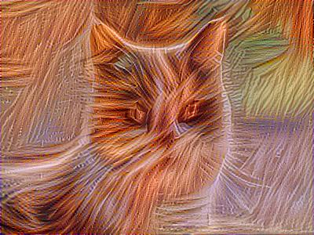

### 首先看一下最后的结果

 

+

 

=



### Loss

Loss函数是非常重要的一环,好的(适应于当前目标任务)Loss函数能使网络收敛更快,更加准确.

`loss`有两部分组成.

1.合成图片和内容图片的loss

$J(C,G) = \frac{1}{(4 * nH * nW * nC)} * \sum_{}(aC - aG)^2 $

aC:内容图片的网络输出,aG:生成图片的网络输出
计算的时候需要transpose.

2.合成图片和风格图片的loss
(某一层的计算,如果是多层需要求和每一层和系数的积)

$J(S,G) = \frac{1}{4 * nH^2 * (nW * nC)^2} * \sum_{}(s_matrix - g_matrix)^2 $

s_matrix: $a_s * a_s^T$,g_matrix:$a_g * a_g^T$

3.总Loss

J = $ \alpha * J(C,G) + \beta * J(S,G)$

alpha,beta一般设置为:10,40

### 调用

```
python generate.py --style style.jpg --content content.jpg
```


